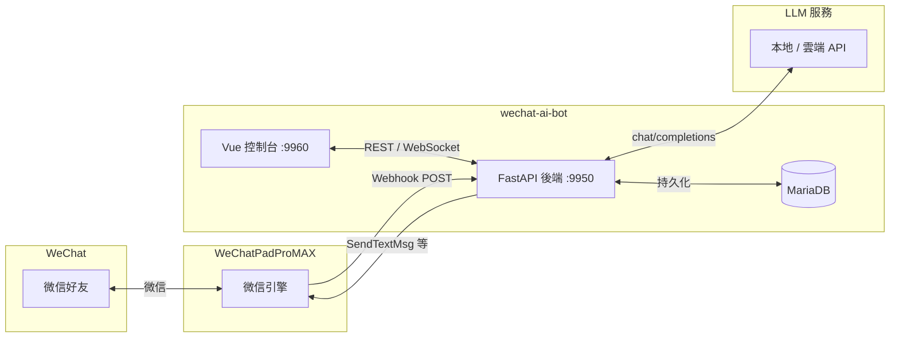

# wechat-ai-bot

以 [WeChatPadProMAX](https://wx.knowhub.cloud/) 為微信閘道，串接本地或雲端大語言模型（OpenAI 相容 API），並提供 Vue 3 網頁控制台，實現微信 AI 代答、人設管理、照片庫與長期記憶等功能。

> **免責聲明**：本專案為開源社群專案，與 WeChatPadProMAX 官方無關。使用微信相關功能須自行取得 PadPro 授權，並遵守微信服務條款與當地法規。作者不對帳號封禁、資料外洩或任何濫用後果負責。

## 架構



## 功能

- **AI 代答**：Webhook 接收訊息，依人設與上下文自動回覆（文字、圖片、語音辨識）
- **全域 / 聯絡人開關**：可逐人啟用或停用 AI
- **多人設庫**：建立、切換、指派不同 System Prompt 人設
- **動態 LLM 設定**：支援 OpenAI、DeepSeek、Groq、Ollama 等 OpenAI 相容端點
- **照片庫**：上傳關鍵字標記圖片，AI 可於對話中選圖發送
- **長期記憶**：自動萃取聯絡人資訊並持久化至資料庫
- **對話紀錄**：訊息、設定、人設皆存於 MariaDB（`db_data/` volume，已列入 `.gitignore`）
- **掃碼登入**：控制台產生 QR Code，透過 PadPro 完成微信登入
- **手動發送**：網頁端代發文字、圖片給指定聯絡人

## 前置需求

- [Docker](https://docs.docker.com/get-docker/) 與 Docker Compose
- 已部署的 **WeChatPadProMAX** 服務（需與本專案容器互通，見下方網路說明）
- 可連線的 **LLM API**（LM Studio、Ollama、OpenAI 等 OpenAI 相容介面）

## 快速開始

```bash
# 1. 複製環境變數範例
cp .env.example .env
cp frontend/.env.example frontend/.env

# 2. 編輯 .env，填入 PadPro 位址、授權碼、wxid、LLM 設定等

# 3. 若與 PadPro 同機 Docker 部署，確認外部網路存在：
docker network create wechatpadpromax_wechat_net   # 若 PadPro 安裝腳本尚未建立

# 4. 啟動
docker compose up -d --build
```

| 服務 | 埠號 | 說明 |
|------|------|------|
| 後端 API | **9950** | FastAPI、Webhook（`/webhook`） |
| 前端控制台 | **9960** | Vue 開發伺服器 |
| MariaDB | 3306（內部） | 僅容器網路內可達 |

瀏覽器開啟 `http://<你的主機>:9960` 即可使用控制台。

### PadPro 網路

根目錄 `docker-compose.yml` 預設加入外部網路 `wechatpadpromax_wechat_net`，以便與 PadPro 容器互通。詳細說明與替代啟動方式見 [`deploy/docker-compose.with-padpro.yml`](deploy/docker-compose.with-padpro.yml)。

### Portainer 部署

若使用 [Portainer](https://www.portainer.io/) 管理容器，可參考 [`deploy/portainer-stack.example.yml`](deploy/portainer-stack.example.yml)。將其中的 `<YOUR_DATA_PATH>` 替換為宿主機專案路徑後，於 Portainer **Stacks → Add stack** 貼上部署。更多說明見 [`deploy/README.md`](deploy/README.md)。

## 環境變數

主要設定見 [`.env.example`](.env.example) 與 [`frontend/.env.example`](frontend/.env.example)。

| 變數 | 說明 |
|------|------|
| `LOCAL_API_BASE` | LLM API 根路徑（OpenAI 相容 `/v1`） |
| `PADPRO_URL` | WeChatPadProMAX 服務位址 |
| `PADPRO_AUTH_KEY` | PadPro 授權碼 |
| `PADPRO_WXID` | 本帳號微信 ID |
| `PADPRO_WEBHOOK_PUBLIC_URL` | 對外 Webhook URL（如 `http://主機:9950/webhook`） |
| `DATABASE_URL` | MySQL 連線字串 |
| `VITE_API_BASE` | 前端連後端 API 位址 |

## 文件

啟動後可於瀏覽器開啟：

| 文件 | 路徑 | 對象 |
|------|------|------|
| 使用者指南 | `http://<主機>:9960/user-guide.html` | 操作說明 |
| 技術手冊 | `http://<主機>:9960/manual.html` | 架構、API、除錯 |
| 開發筆記 | [`docs/AI_PERSONA_AND_DB_STATUS.md`](docs/AI_PERSONA_AND_DB_STATUS.md) | 資料表與實作現況 |
| 開源審查確認書 | [`docs/OPEN_SOURCE_READINESS.md`](docs/OPEN_SOURCE_READINESS.md) | 上架前機敏資料核對清單 |

PadPro 官方文件：[WeChatPadProMAX](https://wx.knowhub.cloud/)

## 安全聲明

**目前控制台無登入驗證。** 任何能存取 `:9960` / `:9950` 的人皆可操作帳號與 AI 設定。僅建議在**內網、VPN 或受信任環境**使用。若需對外暴露，請自行加上反向代理（HTTPS）、IP 白名單或鑑權層。詳見 [SECURITY.md](SECURITY.md)。

## 授權

[MIT License](LICENSE)
