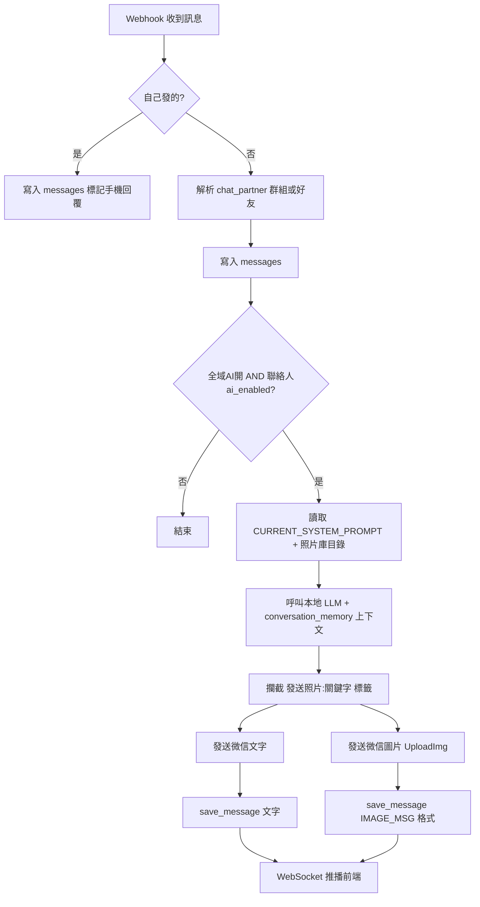

# WeChat AI Bot — AI 人設與資料庫實作現況

> 整理日期：2026-06-22  
> 用途：與 Gemini 或其他 AI 助手對照本專案**已完成 / 未完成**的功能範圍。

---

## 1. 專案架構概覽

| 元件 | 技術 | 對外埠 | 主要檔案 |
|------|------|--------|----------|
| 後端 | FastAPI + SQLAlchemy (async) + MariaDB | **9950** | `main.py` |
| 前端 | Vue 3 + Vite + Tailwind | **8080** | `frontend/src/App.vue`, `api.js` |
| 資料庫 | MariaDB `wechat_ai` | 3306 (內部) | Docker volume `db_data/` |
| 本地 LLM | OpenAI 相容 API (LM Studio 等) | 1234 | `.env` 設定 |
| 微信閘道 | WeChatPadProMAX | 1238 | Webhook → 後端 |

---

## 2. 資料庫資料表（4 張業務表）

### 2.1 `messages` — 對話紀錄（持久化 ✅）

| 欄位 | 型別 | 說明 |
|------|------|------|
| `id` | INT PK | 自動遞增 |
| `wx_id` | VARCHAR(128) | 對話對象：好友 wxid 或群組 `xxx@chatroom` |
| `content` | TEXT | 訊息內容（含特殊標記，見 §4） |
| `is_ai` | BOOLEAN | `true` = AI/自己代發；`false` = 對方訊息 |
| `created_at` | DATETIME | UTC 時間戳 |

**寫入時機：**
- Webhook 收到好友/群組訊息
- AI 自動回覆（文字、圖片分開各一筆）
- 手機自己發的訊息（標記 `[手機回覆]`）
- 前端手動發送（標記 `[網頁回覆]`）

---

### 2.2 `contact_settings` — 聯絡人設定（持久化 ✅）

| 欄位 | 型別 | 說明 |
|------|------|------|
| `wx_id` | VARCHAR(128) PK | 好友或群組 ID |
| `ai_enabled` | BOOLEAN | 是否允許 AI 代答（預設 `false`） |
| `nickname` | VARCHAR(128) NULL | 自訂暱稱（前端顯示用） |

**規則：**
- 新聯絡人/群組首次出現時自動建檔，`ai_enabled=false`
- 群組 (`@chatroom`) 新建時同樣預設關閉 AI
- AI 實際回覆需：**全域 AI 開** + **該聯絡人 ai_enabled=true**

---

### 2.3 `system_prompt_profiles` — AI 人設庫（持久化 ✅）

| 欄位 | 型別 | 說明 |
|------|------|------|
| `id` | INT PK | 人設 ID |
| `name` | VARCHAR(128) | 顯示名稱（如「熱情女孩」） |
| `content` | TEXT | System Prompt 全文 |
| `is_active` | BOOLEAN | 是否為目前啟用人設（同時僅一筆為 true） |
| `created_at` / `updated_at` | DATETIME | 建立/更新時間 |

**運作方式：**
- 啟動時若表為空 → 自動建立「預設人設」並設為 active
- 執行時快取：`CURRENT_SYSTEM_PROMPT` + `ACTIVE_PROMPT_ID`（記憶體）
- 切換/更新人設時同步更新快取，**不需重啟容器**
- 呼叫 LLM 時：`role: system` 使用 `CURRENT_SYSTEM_PROMPT` + 動態附加照片庫目錄

> ⚠️ **與 Gemini 常見建議的差異**：我們用「多人設庫 + is_active」，而非單一 `SystemSettings` key-value 表。功能上更完整。

---

### 2.4 `photo_assets` — AI 發圖素材庫（持久化 ✅）

| 欄位 | 型別 | 說明 |
|------|------|------|
| `id` | INT PK | 圖片 ID |
| `name` | VARCHAR(128) | 顯示名稱 |
| `keywords` | VARCHAR(512) | 關鍵字（逗號分隔，供 AI `[發送照片: 關鍵字]` 匹配） |
| `prompt_hint` | TEXT | 給 LLM 的情境說明（併入 system prompt 目錄） |
| `file_path` | VARCHAR(512) | 磁碟路徑（預設 `/app/photos/`） |
| `original_filename` | VARCHAR(256) | 原始檔名 |
| `created_at` | DATETIME | 上傳時間 |

**檔案儲存：**
- 圖片庫：`PHOTOS_DIR`（預設 `/app/photos`）
- 貼圖/一次性圖片：`PHOTOS_DIR/ephemeral/`（供歷史 `[IMAGE_MSG]` 讀取）

---

## 3. 記憶體狀態（重啟會遺失 ⚠️）

| 變數 | 說明 | 重啟後 |
|------|------|--------|
| `AI_ENABLED` | 全域 AI 總開關 | 重設為 `True`（程式預設） |
| `CURRENT_SYSTEM_PROMPT` | 啟用人設內容 | 從 DB 重新載入 ✅ |
| `conversation_memory` | LLM 多輪對話上下文 `{wx_id: [messages]}` | **清空** |
| `active_frontend_connections` | 前端 WebSocket 連線 | 清空 |

> 對話「顯示歷史」來自 DB `messages`；LLM「上下文記憶」來自記憶體，預設保留最近 `MAX_HISTORY_TURNS` 輪（預設 10）。

---

## 4. 訊息 content 特殊標記格式

| 標記 | 範例 | 用途 |
|------|------|------|
| `[手機回覆]` | `[手機回覆] 你好` | 自己從手機發出 |
| `[網頁回覆]` | `[網頁回覆] 測試` | 前端手動發文字 |
| `[wxid_xxx]:` | `[wxid_abc]: 群組訊息` | 群組內發言者標註 |
| `[IMAGE_MSG]` | `[IMAGE_MSG]/api/photos/3/file` | 圖片訊息（前端渲染 ``） |
| `[發送照片: 關鍵字]` | AI 回覆內隱藏標籤 | 後端攔截後發圖並從文字移除 |

---

## 5. 後端 API 完整清單

### AI 控制與人設

| 方法 | 路徑 | 功能 | 前端已接 |
|------|------|------|----------|
| GET | `/api/status` | 全域 AI 開關狀態 | ✅ |
| POST | `/api/toggle` | 切換全域 AI | ✅ |
| GET | `/api/system_prompt` | 取得目前啟用人設內容 | ✅ |
| POST | `/api/system_prompt` | 快速更新啟用人設內容（相容舊版） | ✅ |
| GET | `/api/system_prompts` | 列出所有人設 + active_id | ✅ |
| POST | `/api/system_prompts` | 新增人設 `{name, content}` | ✅ |
| PUT | `/api/system_prompts/{id}` | 修改人設 | ✅ |
| POST | `/api/system_prompts/{id}/activate` | 切換啟用人設 | ✅ |
| DELETE | `/api/system_prompts/{id}` | 刪除人設（至少保留一筆） | ✅ |
| GET | `/api/test_llm` | 測試本地模型連線 | ✅ |

### 聯絡人與對話

| 方法 | 路徑 | 功能 | 前端已接 |
|------|------|------|----------|
| GET | `/api/contacts` | 聯絡人列表（wx_id, nickname, ai_enabled, last_time） | ✅ |
| POST | `/api/contacts/{wx_id}/toggle_ai` | 聯絡人 AI 開關 | ✅ |
| PUT | `/api/contacts/{wx_id}/nickname` | 更新暱稱 | ✅ |
| GET | `/api/messages` | 對話紀錄（wx_id, keyword, limit） | ✅ |
| POST | `/api/send_message` | 手動發文字/圖片庫圖片 | ✅ |
| POST | `/api/send_message/paste` | 手動發貼上截圖 | ✅ |
| POST | `/api/send_image` | 純發圖片庫圖片 | ✅（API 有，UI 走 send_message） |

### 圖片庫

| 方法 | 路徑 | 功能 | 前端已接 |
|------|------|------|----------|
| GET | `/api/photos` | 列出圖片庫 | ✅ |
| POST | `/api/photos` | 上傳圖片（multipart） | ✅ |
| PUT | `/api/photos/{id}` | 修改名稱/關鍵字/prompt | ✅ |
| DELETE | `/api/photos/{id}` | 刪除 | ✅ |
| GET | `/api/photos/{id}/file` | 讀取圖片檔 | ✅ |
| GET | `/api/ephemeral_images/{token}/file` | 讀取貼圖歷史檔 | ✅ |

### Webhook / 即時推播

| 方法 | 路徑 | 功能 |
|------|------|------|
| POST | `/webhook` | WeChatPadPro HTTP 推送 |
| WebSocket | `/webhook` | WeChatPadPro WS 推送 |
| WebSocket | `/ws/frontend` | 前端即時新訊息推播 |
| GET | `/health` | 健康檢查 |

---

## 6. 前端控制台功能（App.vue）

| UI 區塊 | 功能 | 對應 API |
|---------|------|----------|
| 頂部 Switch | 全域 AI 開關 | `/api/toggle` |
| 「測試 AI 連線」 | 驗證 LLM 可連 | `/api/test_llm` |
| 「⚙️ 人設設定」 | 人設庫管理 Modal | `/api/system_prompts` 系列 |
| 「📷 圖片庫」 | 上傳/管理 AI 發圖素材 | `/api/photos` 系列 |
| 左欄聯絡人列表 | 顯示 `nickname \|\| wx_id` | `/api/contacts` |
| 右欄頂部 | 暱稱、✏️ 編輯名稱、聯絡人 AI 開關 | nickname + toggle_ai |
| 對話氣泡 | 文字高亮搜尋 + `[IMAGE_MSG]` 圖片渲染 | `/api/messages` + WS |
| 底部輸入 | 手動文字、圖片庫附圖、Ctrl+V 貼截圖 | send_message / paste |

---

## 7. AI 回覆完整流程



---

## 8. 僅能透過 `.env` 設定（前端無法改）

| 環境變數 | 預設用途 |
|----------|----------|
| `LOCAL_API_BASE` | LM Studio / Ollama API 位址 |
| `LOCAL_API_KEY` | 模型 API Key |
| `LOCAL_MODEL_NAME` | 模型名稱 |
| `MAX_HISTORY_TURNS` | LLM 記憶輪數 |
| `PADPRO_URL` / `PADPRO_AUTH_KEY` / `PADPRO_WXID` | 微信發送 |
| `DATABASE_URL` | MariaDB 連線 |
| `PHOTOS_DIR` | 圖片儲存目錄 |

---

## 9. 與 Gemini 常見建議對照表

| Gemini 常見建議 | 本專案現況 | 備註 |
|-----------------|------------|------|
| `SystemSettings` 單表存 system_prompt | ❌ 未採用 | 改用 `system_prompt_profiles` 多人設庫，功能更強 |
| `GET/PUT /api/settings/system_prompt` | ❌ 路徑不同 | 等價功能見 `/api/system_prompts` |
| 每次 LLM 呼叫查 DB 取 prompt | ⚠️ 部分 | 用記憶體快取，更新/切換時同步 |
| `ContactSettings.nickname` | ✅ 已完成 | PUT `/api/contacts/{wx_id}/nickname` |
| 聯絡人顯示暱稱 | ✅ 已完成 | 左欄 + 右欄頂部 |
| 單一 textarea 編輯人設 | ✅ 已超越 | 人設庫：多名稱、切換、刪除 |
| 圖片發送 `[發送照片:]` 機制 | ✅ 已完成 | + DB 圖片庫 + 前端管理 |
| 圖片歷史持久化 `[IMAGE_MSG]` | ✅ 已完成 | 重整後可顯示 |
| 群組 `@chatroom` 合併對話 | ✅ 已完成 | wx_id = 群組 ID |
| 群組預設關閉 AI | ✅ 已完成 | 新建 ContactSettings 時 |
| 前端設定模型 URL/名稱 | ❌ 未實作 | 仍靠 `.env` |
| 每聯絡人不同人設 | ❌ 未實作 | 目前全域一套人設 |
| LLM 上下文持久化到 DB | ❌ 未實作 | 僅記憶體 `conversation_memory` |
| 全域 AI 開關持久化 | ❌ 未實作 | 重啟恢復預設 `True` |

---

## 10. 主要原始碼檔案索引

```
ai.wechat.project/
├── main.py                 # 後端全部邏輯（Webhook、API、DB、LLM）
├── requirements.txt        # Python 依賴
├── .env / .env.example     # 環境變數（LLM、微信、DB）
├── docs/
│   └── AI_PERSONA_AND_DB_STATUS.md   # 本文件
├── frontend/
│   ├── src/
│   │   ├── App.vue         # 控制台 UI（人設、圖片庫、對話、暱稱）
│   │   └── api.js          # 前端 API 封裝
│   ├── .env                # VITE_API_BASE
│   └── vite.config.js
└── db_data/                # MariaDB 資料檔（Docker volume）
```

---

## 11. 快速結論（給 Gemini 的一句話）

**我們已完成：** 多人設 DB 持久化 + 前端人設庫管理、聯絡人 AI 開關/暱稱、對話/圖片訊息 DB 持久化、AI 隱藏發圖標籤、圖片庫 DB+檔案、群組訊息合併。  
**我們尚未完成：** 前端設定 LLM 連線參數、每聯絡人獨立人設、LLM 上下文/全域開關 DB 持久化。

---

## 12. 相關程式碼錨點（供查閱）

| 功能 | 檔案 | 約略位置 |
|------|------|----------|
| 資料表定義 | `main.py` | `Message`, `ContactSettings`, `SystemPromptProfile`, `PhotoAsset` |
| 人設載入/切換 | `main.py` | `load_active_system_prompt_from_db`, `activate_system_prompt_profile` |
| LLM 呼叫 | `main.py` | `get_local_llm_reply`, `_build_llm_messages` |
| AI 發圖攔截 | `main.py` | `process_ai_photo_tags` |
| 群組解析 | `main.py` | `_parse_message`, `_resolve_chatroom_id` |
| 人設前端 UI | `App.vue` | `showPromptModal`, `loadSystemPrompts` |
| 圖片渲染 | `App.vue` | `parseMessageSegments`, `resolveImageUrl` |
